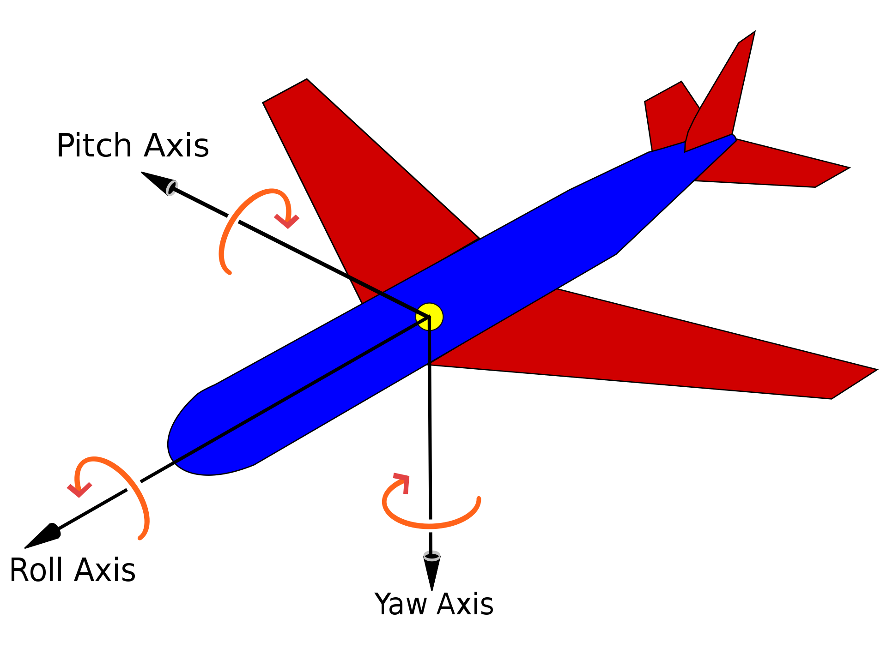

<h1>Sprint 4 - Complete control of Drone</h1>

<h3>Step 1: Initial Setup</h3>

1. Open a new terminal window and run the below command to clone this repository.

    ```
    git clone https://github.com/SLUSE-Spring2022/sprint1-team6_sprint1.git
    ```

2. Create a python virtual environment inside the cloned repository on local.

    ```
    python3 -m venv venv
    ```

3. Activate the virtual environment.

    ```
    source venv/bin/activate
    ```

4. Install flask web server framework.
    
    ```
    pip install flask
    ```

5. Install dronekit-sitl library.
    
    ```
    pip install dronekit-sitl
    ```

6. Go into site-pacakages directory in the virtual environment libraries directory.
    
    ```
    cd venv/lib/python3.11/site-packages
    ```

7. Delete the ***dronekit*** directory from sitepackages.

8. Clone the dronekit-python repository in site-packages.

    ```
    git clone https://github.com/dronekit/dronekit-python.git
    ```

9. Follow the steps in this <a href="https://dronekit-python.readthedocs.io/en/latest/contributing/developer_setup_linux.html">link</a> to build and install dronekit library.

10. Clone and install ardupilot for using the simulator functionalities.

11. Follow this <a href="https://reactnative.dev/docs/environment-setup?guide=native">link</a> to download and install react-native development framework to run IOS device emulator.

12. Deactivate the virtual environment and close the terminal.

    ```
    deactivate
    ```

<h3>Installation Steps for Cocoapods</h3>

1. open a new terminal window.

2. Run the below command to install cocoapods.

    ```
    sudo gem install cocoapods
    ```

3. If you are successful in installing cocoapods from above step ignore all the below steps.

4. If you are not successful in downloading cocoapods follow the below steps. Switch to root user:

    ```
    sudo su -
    ```

5. Change write permissions for /Library/Ruby/Gems/2.6.0 directory

    ```
    chmod -R u+w /Library/Ruby/Gems/2.6.0
    ```

6. Update activesupport version.

    ```
    gem install activesupport -v 6.1.7.3
    ```

7. Make sure you have installed xcode command line tools. If you dont have the xcode CLI tools, install them.

    ```
    xcode-select --install
    ```

8. Now install cocoapods using the command from step-2 under ***Installation of cocoapods***.


<h3>Step 2: Run ArduPlane simulator and Flask web server</h3>

1. Open a new terminal window and activate the python virtual environment.

    ```
    source venv/bin/activate
    ```

    ***Note:*** Make sure you go into the sprint1-team6_sprint1 directory before activating the virtual environment.

2. Go into ArduPlane directory inside ardupilot.

    ```
    cd ardupilot/ArduPlane
    ```

3. Open the simulator.

    ```
    sim_vehicle.py --map --console
    ```

    ***Note:*** Make sure you add the path to sim_vehicle.py to your .bashrc fie and source the .bashrc file before running the above command.

4. From this terminal copy the sitl out url and paste it in the connection_string variable in Drone_Program.py file and save it.

5. Open a new terminal window and activate the python virtual environment.

    ```
    source venv/bin/activate
    ```

    ***Note:*** Make sure you go into the sprint1-team6_sprint1 directory before activating the virtual environment.

6. Export your flask app.

    ```
    export FLASK_APP=FlaskWebServer.py
    ```

7. Run your flask server.

    ```
    flask run
    ```

8. Copy the url displayed in this terminal and replace the url it in the App.tsx file inside AwesomeProject directory. After changing the url the code inside processArm() function should look like this.

    ```
    fetch('<your-server-url>/arm', {
      method: 'POST',
      headers: {
        Accept: 'application/json',
        'Content-Type': 'application/json',
      },
      body: JSON.stringify({
        message: 'ArmDrone'
      }),
    })
      .then(response => response.json())
      .catch(error => {
        console.error(error);
      });
    ```


<h3> Step 3: Run the emulator and test the arm function</h3>

1. Open a new terminal window and go inside sprint1-team6_sprint1 cloned local repository.

2. Go inside AwesomeProject directory.

    ```
    cd AwesomeProject
    ```

3. Run your IOS emulator and open the application in the emulator.

    ```
    npx react-native run-ios
    ```

    ***Note:*** If a new terminal window appears prompting you to select the device type just click 'i' and then click 'return/enter'.

4. Once the app gets opened on your emulator click the ***Arm Drone*** button in the app and observe the drone getting armed in the console opened as a part of opening the simulator.

5. After successfully testing the application go to each terminal window and use  ***'^+C'***  keyboard shortcut to end the running process.

6. Deactivate the virtual environment.

    ```
    deactivate
    ```

7. Close the opened terminal windows.


<h3> Instructions to fly the drone </h3>

1. For flying the the drone skip the steps ***5, 6, 7*** from ***Run the emulator and test the arm function***.

***NOTE:*** For ease of access of the joysticks rotate your mobile device into landscape mode before flying the drone.

2. Click the ***ArmDrone*** button on the app to arm the drone prior to flying the drone. Make sure the drone is armed before increasing the throttle of the drone to prep it for takeoff.

3. Slide your left joystick on the app to up position to increase the throttle of the drone.

4. Wait till the throttle value reaches to a value between ***60*** and ***70***. After it reaches that particular throttle value slide your right joystick on the app to up position for takeoff.

5. To decrease the throttle value slide your left joystick on the app to down position.

6. To increase the pitch/elevator value slide your right joystick on the app to down position.

7. Slide your right joystick on the app to up position to decrease the pitch.

8. To change the rudder position and control the yaw movement of an ArduPlane use left joystick left and right movements on the mobile app.

9. To change the aileron position and control the roll movement of an ArduPlane use right joystick left and right movements on the mobile app.

<h3> Web Server API Documentation </h3>

1. ArmDrone request:

    a. Request url: http://127.0.0.1:5000/arm

    b. Method: POST

    c. Accepted parameter type: String

    d. Accepted parameter value: 'ArmDrone'

    e. Description: ArmDrone request arms the drone when the button 'ArmDrone' is clicked on the mobile app. The drone should be armed prior to flying it.

2. Throttle request:

    a. Request url: http://127.0.0.1:5000/throttle

    b. Method: POST

    c. Accepted parameter type: String

    d. Accepted parameter values: 'IncThrottle', 'DecThrottle'

    e. Description: Throttle request is responsible for changing the throttle of the drone when the left joystick is moved up or down in the mobile app. When the joystick is dragged to up position the message 'IncThrottle' is sent to flask web server which increases the throttle of the plane while moving the left joystick to down position 'DecThrottle' message is sent to the flask web server which decreases the throttle of the plane.

3. Elevator request:

    a. Request url: http://127.0.0.1:5000/elevator

    b. Method: POST

    c. Accepted parameter type: Float

    d. Accepted parameter values range: [-1,1] (both -1 and 1 are included)

    e. Description: Elevator request is responsible for changing the pitch of the drone when the right joystick is moved up or down in the mobile app. When the joystick is dragged to up position the the y coordinate of the joystick position whose value is between -1 and 0 is sent to flask web server which decreases the pitch of the plane while moving the joystick to down position the y coordinate of the joystick position whose value is between 0 and 1 is sent to flask web server which increases the pitch of the plane.

4. Rudder request:

    a. Request url: http://127.0.0.1:5000/rudder

    b. Method: POST

    c. Accepted parameter type: Float

    d. Accepted parameter values range: [-1,1] (both -1 and 1 are included)

    e. Description: Rudder request is responsible for changing the yaw movement of the drone when the left joystick is moved in left or right directions in the mobile app. When the joystick is dragged to left position the the x coordinate of the joystick position whose value is between -1 and 0 is sent to flask web server which turns the plane to left direction while moving the joystick to right position the x coordinate of the joystick position whose value is between 0 and 1 is sent to flask web server which turns the plane to right direction. The axis considered for this movement is a perpendicular axis passing through the center of the plane.

5. Aileron request:

    a. Request url: http://127.0.0.1:5000/aileron

    b. Method: POST

    c. Accepted parameter type: Float

    d. Accepted parameter values range: [-1,1] (both -1 and 1 are included)

    e. Description: Aileron request is responsible for changing the roll movement of the drone when the right joystick is moved in left or right directions in the mobile app. When the joystick is dragged to left position the the x coordinate of the joystick position whose value is between -1 and 0 is sent to flask web server which tilts/rolls the plane in left direction while moving the joystick to right position the x coordinate of the joystick position whose value is between 0 and 1 is sent to flask web server which tilts/rolls the plane in right direction. The axis considered for this movement passes form the tail to the nose tip of the plane.
    
We have updated the User Interface (UI) design while considering the 8 golden rules to improve the user experience. Additionally, we have introduced a configurable Step Size feature that enables the user to adjust the percentage increase or decrease (Value from 10 to 100)in the control of the plane. This will help us in determining the required control granularity to effectively manage the plane.

Based on the 8 golden principles of User Interface, we have made the Arm Drone button more prominent to the user, Our user interface design is more consistent, simple, intuitive, and visually appealing. 

<h3> Axes Representation of the plane </h3>


